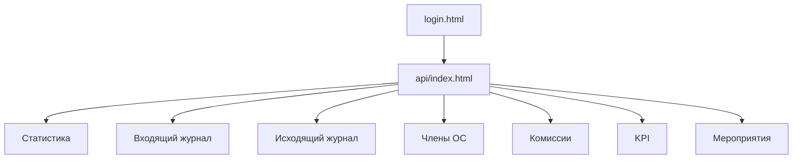

# Анализ интерфейса и возможностей «Журнал ОС»

Дата: 15 июня 2026  
Проект: Журнал Общественного Совета  
Figma (редизайн): [Журнал Общественного Совета — Редизайн](https://www.figma.com/design/eqynnwFV4PPHIQLhmVQLtb)

---

## 1. Краткое описание системы

**Журнал ОС** — веб-приложение для учёта входящих и исходящих писем Общественного Совета, членов, комиссий, KPI и мероприятий.

| Параметр | Значение |
|----------|----------|
| Frontend | SPA на `api/index.html` + `api/app.js` (ванильный JS, Bootstrap 5) |
| Backend | PHP 7.4+, REST API в `api/*.php` |
| БД | MySQL / PostgreSQL / SQLite |
| Авторизация | Сессии PHP, роли `admin` / `moderator` / `viewer` |
| Дизайн-система | CSS-токены в `styles.css`, макет в Figma `eqynnwFV4PPHIQLhmVQLtb` |

**Точки входа:**
- `index.html` — редирект на `/api/`
- `login.html` — страница входа
- `api/index.html` — основное приложение

---

## 2. Карта экранов (7 вкладок)



| Вкладка | ID | Назначение |
|---------|-----|------------|
| Статистика | `tab-dashboard` | KPI, графики, сводка, активность комиссий |
| Входящий журнал | `tab-incoming` | CRUD входящих писем, фильтры, сроки ответа |
| Исходящий журнал | `tab-outgoing` | CRUD исходящих ответов ОС |
| Члены ОС | `tab-members` | Просмотр карточек членов (read-only) |
| Комиссии | `tab-commissions` | Просмотр карточек комиссий (read-only) |
| KPI | `tab-kpi` | Таблицы KPI, топ адресатов |
| Мероприятия | `tab-events` | CRUD мероприятий, учёт явки |

**Глобальная оболочка (всегда видна):**
- Боковая панель: бренд, навигация, пользователь, выход
- Верхняя панель: заголовок, контекстные кнопки, уведомления, экспорт CSV/JSON, импорт JSON
- Мобильное меню (≤991px)

---

## 3. Полный инвентарь функций

### 3.1. Аутентификация и безопасность

| Функция | UI | API |
|---------|-----|-----|
| Вход | `login.html` | `POST auth.php?action=login` |
| Проверка сессии | `api/index.html` | `GET auth.php` |
| Выход | кнопка в сайдбаре | `POST auth.php?action=logout` |
| CSRF-токен | `csrf-handler.js` | `GET auth.php?action=csrf` |
| Роли | косвенно (удаление — только admin) | `auth_middleware.php` |
| Таймаут сессии 30 мин | — | сервер |
| Фильтр по региону | отображение в сайдбаре | `region_id` в сессии |

**Права:** создание/редактирование — `admin`, `moderator`; удаление — только `admin`.

### 3.2. Входящие письма (`tab-incoming`)

**CRUD:** `GET/POST/PUT/DELETE letters.php?type=incoming`

| Возможность | Описание |
|-------------|----------|
| Категории | ҚК, .Н, ЖТ, ЗТ |
| Автонумерация | `seq` (база 1328+) |
| Адресаты | Несколько получателей (chips) |
| Ответственные | Multiselect членов ОС, первый = ведущий |
| Связь с исходящим | Ответ на исходящее, привязка готового ответа |
| Сканы/вложения | Изображения, PDF, Office, видео, архивы |
| Срок ответа | 15 рабочих дней, предупреждение за 3 дня |

**Фильтры:** поиск, год, месяц (захардкожен 2024), наличие сканов, адресат.

### 3.3. Исходящие письма (`tab-outgoing`)

**CRUD:** `GET/POST/PUT/DELETE letters.php?type=outgoing`

| Возможность | Описание |
|-------------|----------|
| Связь с входящим | Опциональная привязка `incoming_ref_id` |
| Тип адресата | gov, jt, zt, recommend, other |
| Автонумерация | `seq` / `outgoing_number` (база 1400+) |
| Адресаты, ответственные, сканы | Аналогично входящим |

### 3.4. Члены ОС (`tab-members`)

| Функция | UI | API |
|---------|-----|-----|
| Просмотр списка | карточки `#membersGrid` | `GET members.php` |
| Фильтр по комиссии | select | клиент |
| Загрузка фото | **нет в UI** | `POST upload_photo.php` |

**CRUD в интерфейсе отсутствует.**

### 3.5. Комиссии (`tab-commissions`)

| Функция | UI | API |
|---------|-----|-----|
| Просмотр списка | карточки | `GET commissions.php` |

**CRUD в интерфейсе отсутствует.**

### 3.6. KPI (`tab-kpi`)

**API:** `GET kpi.php` (кэш 30 мин)

| Блок | Метрики |
|------|---------|
| Таблица членов | исходящие, входящие, ведущий, мероприятия |
| Таблица комиссий | исходящие, входящие, мероприятия |
| Топ адресатов | топ-10 входящих / исходящих |

### 3.7. Мероприятия (`tab-events`)

**CRUD:** `GET/POST/PUT/DELETE events.php`

| Поле | Описание |
|------|----------|
| Название, дата, локация, примечание | Основные данные |
| Участники | Чеклист всех членов ОС |
| KPI мероприятия | Произвольные метрики |
| Явка | Авторасчёт % присутствия |

### 3.8. Статистика (`tab-dashboard`)

| Блок | Источник данных |
|------|-----------------|
| 4 KPI-карточки | Клиент (`store`) |
| График динамики | Chart.js, объединённый тренд |
| Оперативная сводка | Клиент (без ответа, просрочено и др.) |
| Активность комиссий | `kpi.php` |
| Топ организаций | Chart.js |

### 3.9. Глобальные функции

| Функция | Статус |
|---------|--------|
| Экспорт JSON | Работает |
| Экспорт CSV | Работает |
| Импорт JSON | **Отключён** (alert) |
| Уведомления о сроках | Модалка + бейдж |
| Realtime (Pusher) | Письма, мероприятия, дедлайны |
| Toast / loading overlay | Работает |

### 3.10. Модальные окна

| ID | Назначение |
|----|------------|
| `eventAttendeesModal` | Список присутствующих |
| `letterRecipientsModal` | Адресаты письма |
| `linkOutgoingModal` | Привязка исходящего |
| `confirmDeleteModal` | Подтверждение удаления (**JS не подключён**) |
| `scanViewerModal` | Просмотр сканов (carousel) |
| `notifyModal` | Просроченные / без ответа |

---

## 4. Backend API: что есть, но не в UI

| Endpoint | Назначение | В UI |
|----------|------------|------|
| `statistics.php` | Сводная статистика региона | Нет (считается на клиенте) |
| `advanced_stats.php` | Расширенная аналитика | Нет |
| `search.php` | Полнотекстовый поиск | Нет (поиск клиентский) |
| `export_pdf.php` | PDF-отчёт | Нет |
| `upload_photo.php` | Фото члена ОС | Нет |
| `scan_download.php` | Скачивание скана | Нет (base64 в JSON) |
| `notifications.php` | Очередь email | Нет |
| `audit_logs.php` | Журнал аудита | Нет |
| `regions.php` | CRUD регионов | Нет |

---

## 5. Состояние дизайна по экранам

### Уже в стиле редизайна (Figma / design tokens)

| Экран | Компоненты |
|-------|------------|
| `login.html` | Бренд navy/gold, градиент, карточка входа |
| App shell | Sidebar, topbar, responsive toggle |
| Статистика | `dash-stat`, `dash-insight`, `dash-chart-card`, `dash-commission` |
| Входящий журнал | `form-card`, `toolbar-panel`, `data-card`, `table-actions` |
| Исходящий журнал | `form-card`, `data-card` (фильтры без `toolbar-panel`) |
| Члены ОС | `member-card`, `empty-state` |
| Комиссии | `commission-card` |

### Отстаёт от общего стиля

| Экран / элемент | Проблема |
|-----------------|----------|
| Мероприятия | Обычные `.card`, форма всегда открыта, emoji вместо иконок |
| KPI | Стандартные таблицы Bootstrap без `data-card` |
| Модалки | Минимальная кастомизация |
| Исходящий журнал | Фильтры без `toolbar-panel` |
| Кнопки в таблицах | Входящие — иконки; исходящие/мероприятия — текст |
| Multiselect ответственных | Нативный `<select multiple>` |

### Design tokens (`styles.css`)

```css
--brand-primary: #1D4ED8
--brand-navy: #0F1B33
--brand-gold: #D9A521
--bg-page: #F5F6FA
--sidebar-width: 260px
```

Синхронизация с Figma: `eqynnwFV4PPHIQLhmVQLtb`

**В Figma готовы экраны:** Вход, Статистика, Входящий журнал, Члены ОС, компоненты (Button, Badge, KPI, Sidebar).  
**В Figma не сделаны:** Исходящий журнал, Комиссии, KPI, Мероприятия.

---

## 6. Выявленные проблемы и пробелы

### Функциональные

1. `confirmDeleteModal` — разметка есть, `window.confirmDelete` не реализован → используется `window.confirm()`
2. Импорт JSON отключён в `importJson()`
3. `animateCounter` не определён — KPI без анимации счётчика
4. `#summaryResponsible` — ищется в JS, элемента нет в HTML
5. Фильтр месяцев захардкожен на 2024 (нет динамики)
6. Нет CRUD для членов и комиссий в UI
7. Нет админки пользователей и регионов

### Дизайн / UX

1. Несогласованность вкладок (мероприятия, KPI — «сырой» Bootstrap)
2. CSS-классы `modal-notify-stats`, `stat-chip` описаны, но не используются
3. Класс `members-chips` рендерится в JS, стилей нет
4. Разные версии Bootstrap/icons на login vs app
5. Нет единого паттерна пустых состояний на всех вкладках
6. Нет dark mode, i18n

### Технические

1. `statistics.php` / `advanced_stats.php` дублируют клиентскую логику
2. Скрытые legacy-элементы в дашборде (`chartIncomingByMonth` и др.)
3. Figma MCP на тарифе Starter — лимит вызовов, правки макета из IDE ограничены

---

## 7. Матрица: функции × вкладки

```
┌─────────────────┬──────────┬──────────┬─────────┬──────────┬──────┬─────────┐
│                 │ Dashboard│ Incoming │ Outgoing│ Members  │ Comm │ KPI/Ev  │
├─────────────────┼──────────┼──────────┼─────────┼──────────┼──────┼─────────┤
│ CRUD писем      │    —     │   C R U D│ C R U D │    —     │  —   │    —    │
│ CRUD мероприятий│    —     │    —     │    —    │    —     │  —   │ C R U D │
│ Справочники     │  read    │  select  │ select  │  read    │ read │ checklist│
│ Фильтры/поиск   │    —     │    ✅    │   ✅    │ комиссия │  —   │  поиск  │
│ Сканы           │  count   │  full    │  full   │    —     │  —   │    —    │
│ KPI/графики     │  client  │  сроки   │    —    │    —     │  —   │  server │
│ Уведомления     │  alerts  │  сроки   │    —    │    —     │  —   │    —    │
│ Экспорт         │  global CSV/JSON (header)              │  —   │    —    │
│ Realtime        │  global Pusher                         │  —   │    —    │
└─────────────────┴──────────┴──────────┴─────────┴──────────┴──────┴─────────┘
```

---

## 8. Рекомендации по дизайну (приоритеты)

### Фаза A — Унификация существующих экранов (быстрый эффект)

| # | Задача | Файлы |
|---|--------|-------|
| A1 | Мероприятия: `form-card` collapse, `toolbar-panel`, `data-card`, иконки Bootstrap | `index.html`, `styles.css`, `app.js` |
| A2 | KPI: обернуть таблицы в `data-card`, единый стиль заголовков | `index.html`, `styles.css` |
| A3 | Исходящий журнал: `toolbar-panel` как у входящих | `index.html` |
| A4 | Единые `table-actions` (иконки) во всех таблицах | `app.js` |
| A5 | Модалка уведомлений: использовать `stat-chip`, `modal-notify-stats` | `index.html`, `app.js` |
| A6 | Реализовать `confirmDeleteModal` вместо `window.confirm()` | `app.js` |
| A7 | Стили для `members-chips`, recipient chips | `styles.css` |

### Фаза B — Улучшение дашборда и UX

| # | Задача |
|---|--------|
| B1 | Переключатель периода (месяц / квартал / год) на графике |
| B2 | Клик по «Без ответа» / «Просрочено» → переход в журнал с фильтром |
| B3 | Подключить `statistics.php` вместо дублирования на клиенте |
| B4 | Динамические фильтры год/месяц вместо захардкоженного 2024 |
| B5 | Анимация счётчиков KPI (`animateCounter`) |

### Фаза C — Новый UI для скрытого backend

| # | Задача | API |
|---|--------|-----|
| C1 | Загрузка фото члена ОС | `upload_photo.php` |
| C2 | Кнопка «Скачать PDF» в topbar | `export_pdf.php` |
| C3 | Глобальный поиск в шапке | `search.php` |
| C4 | Вкладка «Аудит» (только admin) | `audit_logs.php` |
| C5 | Расширенная аналитика на дашборде | `advanced_stats.php` |

### Фаза D — Figma и документация

| # | Задача |
|---|--------|
| D1 | Доработать в Figma: исходящий, KPI, мероприятия, комиссии |
| D2 | Полировка готовых 4 экранов в Figma (при сбросе лимита MCP) |
| D3 | Code Connect / синхронизация токенов Figma ↔ `styles.css` |

---

## 9. Структура файлов проекта (UI)

```
public_html/
├── login.html              # Страница входа
├── styles.css              # Design tokens + компоненты
├── csrf-handler.js         # CSRF для fetch
├── api/
│   ├── index.html          # SPA: 7 вкладок, модалки, topbar
│   ├── app.js              # Вся логика UI (~3300 строк)
│   ├── auth.php            # Авторизация
│   ├── letters.php         # Письма
│   ├── events.php          # Мероприятия
│   ├── members.php         # Члены ОС
│   ├── commissions.php     # Комиссии
│   ├── kpi.php             # KPI
│   ├── statistics.php      # (не в UI)
│   └── ...
└── src/                    # PHP-классы (middleware, cache, audit)
```

---

## 10. Итог

**Сильные стороны:**
- Полноценный учёт писем со связями, сроками, сканами
- Современный shell (sidebar + topbar) и обновлённый дашборд
- Роли, CSRF, аудит на backend
- Realtime через Pusher

**Главные точки роста по дизайну:**
1. Довести до единого стиля вкладки **Мероприятия** и **KPI**
2. Унифицировать таблицы и модалки
3. Подключить скрытые API (фото, PDF, поиск, аудит)
4. Синхронизировать Figma с кодом

**Рекомендуемый порядок работ:** Фаза A → B → C → D.

---

*Документ подготовлен на основе анализа кодовой базы `public_html` и макета Figma `eqynnwFV4PPHIQLhmVQLtb`.*
